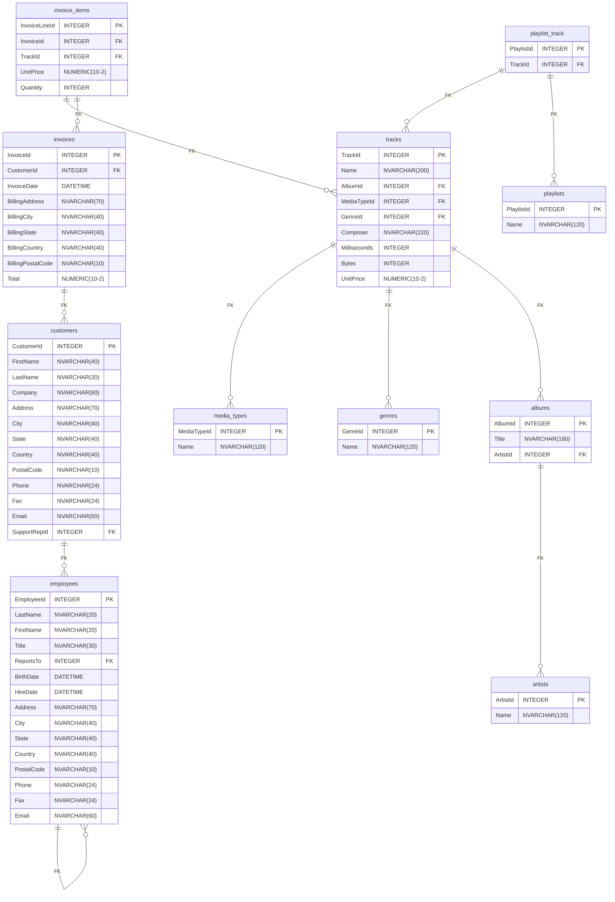

# SQLite-to-Mermaid


## Project Overview
This Node.js microservice project serves mermaid ERDiagrams from SQLlite BLOBs. It is designed to be wrapped in an API using Express (todo)
Currently it outputs ERDs in ./out/ these can be tested via https://mermaid.live

### Prerequisites
To run this project, you need to have Node.js installed on your machine. You can download it from nodejs.org.

### Installation
Clone the project repository to your local machine:

```bash
git clone https://github.com/hdbham/SQLite-to-Mermaid
```
Navigate to the project directory:

```bash
cd SQLite-to-Mermaid
```
Install project dependencies:

```bash
npm install
```
### run
```bash
node index.js
```
TODO: API Implementation
The project is designed to be wrapped in an API using Express. This section will be updated with API implementation details.


Example Schema 

